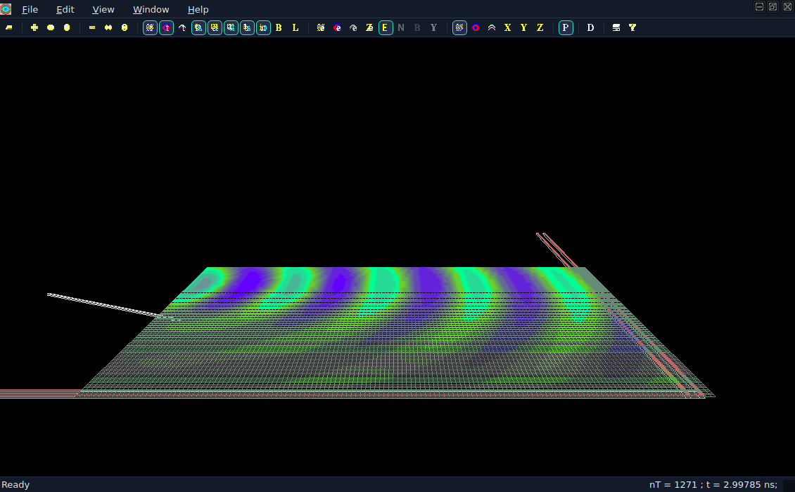
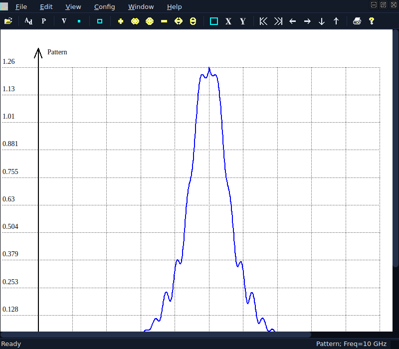
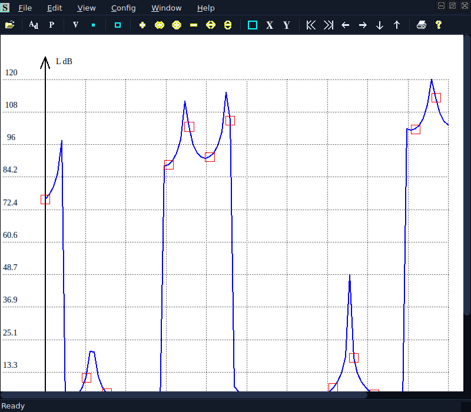
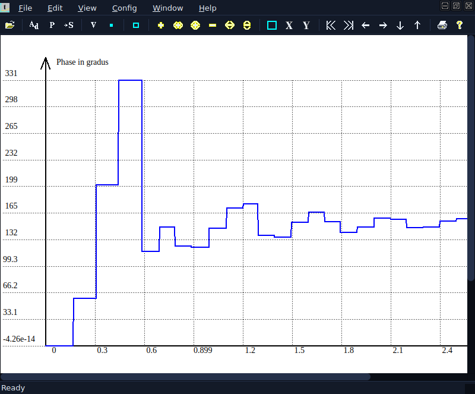
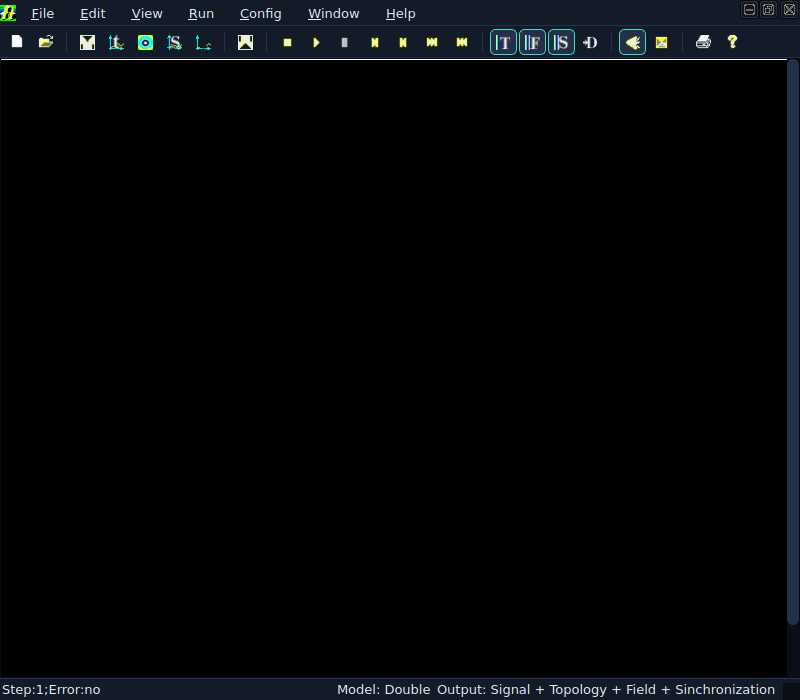

<div align="center">

# TMC Suite for Linux

**Scientific software package for electrodynamic simulation of planar structures**

C++ · Qt 6 · OpenGL · Linux (x64)

**English** · [Русский](#tmc-suite-для-linux)



</div>

---

## Overview

**TMC Suite** is an authorial scientific software package by **K. N. Klimov** for electrodynamic
computation and visualization of planar structures (H-polarization and X-mode). This repository is
the **Linux port of the graphical programs**: the same six programs as on Windows, with the same
windows, menus and dialogs, rebuilt on Qt 6 instead of MFC.

The computational code is not rewritten. It is the Windows source tree compiled by `g++` as is, so
the numbers stay the same and the file formats stay compatible: a task calculated on Windows opens
here, and a result calculated here opens in the Windows version.

## Components

### Computational kernels
| Program | Executable | Purpose |
|---|---|---|
| **PlanarRT_H** | `planarrt_h` | Solver, H-polarization |
| **PlanarRT_X** | `planarrt_x` | Solver, X-mode (incl. magnetized plasma) |

### Viewers & visualization
| Program | Executable | Purpose |
|---|---|---|
| **TMCGROUT** | `tmcgrout` | Scattering-matrix plots |
| **TMC_DN** | `tmc_dn` | Radiation (directional) patterns |
| **TMCROS** | `tmcros` | Time-domain signals |
| **FieldView** | `fieldview` | Interactive OpenGL visualization of electromagnetic fields |

### Libraries
`sfile95` · `complex` · `exprint` · `TMCLibError` · `prepr` · `TMCIndan`

## Screenshots

| Radiation pattern (TMC_DN) | Scattering matrix (TMCGROUT) |
|---|---|
|  |  |

| Time-domain signal (TMCROS) | Solver shell (PlanarRT_H) |
|---|---|
|  |  |

## Installation

A ready-made package is available on the project website:

```
sudo apt install ./tmc-suite_1.0.0_amd64.deb
```

Requirements: Ubuntu 24.04 LTS or compatible (glibc 2.39), x64. FieldView needs OpenGL.

## Building from source

```
sudo apt install -y build-essential cmake ninja-build pkg-config \
     qt6-base-dev qt6-base-dev-tools qt6-tools-dev qt6-tools-dev-tools \
     libgl1-mesa-dev libglu1-mesa-dev fonts-liberation

cmake -S . -B build -G Ninja -DCMAKE_BUILD_TYPE=Release
cmake --build build -j
```

The programs appear in `build/bin`. A step-by-step guide, including building in **Eclipse CDT**, is
in [`docs/build-guide/eclipse-cdt.md`](docs/build-guide/eclipse-cdt.md).

> On a case-sensitive file system, run `python3 tools/check_case.py` before building: it compares
> every `#include` with the real file name on disk.

## Headless use

Every program accepts a task on the command line, and the solver shells can calculate without
windows at all:

```
planarrt_h -Arb /full/path/task.tpl
```

The output file names come from the task itself. See the “Headless mode” chapter of the user
manual for exit codes and batch processing.

## Input format

Simulations are described in **`.tpl`** text files (the TAMIC input language): geometry, materials,
sources, frequency sweeps and output requests. The format is shared by all three platforms.

## Relation to the other ports

| Repository | What it is |
|---|---|
| [TMC Suite (Windows)](https://github.com/klimov-kn/TMC_Suite) | the original package, MFC / OpenGL |
| **this repository** | Linux, graphical programs on Qt 6 |
| [TMC Suite for Linux (console)](https://github.com/klimov-kn/TMC_Suite_Linux_Console) | Linux, computation kernels without windows |
| [TMC Suite for macOS](https://github.com/klimov-kn/TMC_Suite_MacOS) | macOS, universal build for Apple Silicon and Intel |

## Documentation

Full documentation is published on the project website: user manual with screenshots, the `.tpl`
task language reference, installation, architecture and API reference.

## Author & links

- **Author of the scientific code:** K. N. Klimov
- **Porting, build and documentation:** M. S. Matsayan
- **Website:** [www.tamic.ru](https://www.tamic.ru)

## License

See [`LICENSE`](LICENSE).

---
---

<div align="center">

# TMC Suite для Linux

**Научный пакет для электродинамического моделирования планарных структур**

C++ · Qt 6 · OpenGL · Linux (x64)

[English](#tmc-suite-for-linux) · **Русский**

</div>

---

## О пакете

**TMC Suite** — авторский научный пакет **К. Н. Климова** для электродинамического расчёта и
визуализации планарных структур (H-поляризация и X-мода). В этом репозитории — **перенос
графических программ на Linux**: те же шесть программ, что и на Windows, с теми же окнами, меню и
диалогами, собранные на Qt 6 вместо MFC.

Вычислительный код не переписывался. Это исходники Windows-версии, скомпилированные `g++` как есть,
поэтому числа остаются теми же, а форматы файлов — совместимыми: задание, посчитанное на Windows,
открывается здесь, а результат, посчитанный здесь, открывается в Windows-версии.

## Состав

### Счётные ядра
| Программа | Файл | Назначение |
|---|---|---|
| **PlanarRT_H** | `planarrt_h` | расчёт, H-поляризация |
| **PlanarRT_X** | `planarrt_x` | расчёт, X-мода (в том числе замагниченная плазма) |

### Просмотр результатов
| Программа | Файл | Назначение |
|---|---|---|
| **TMCGROUT** | `tmcgrout` | характеристики матрицы рассеяния |
| **TMC_DN** | `tmc_dn` | диаграммы направленности |
| **TMCROS** | `tmcros` | сигналы во времени |
| **FieldView** | `fieldview` | визуализация электромагнитных полей на OpenGL |

### Библиотеки
`sfile95` · `complex` · `exprint` · `TMCLibError` · `prepr` · `TMCIndan`

## Снимки окон

| Диаграмма направленности (TMC_DN) | Матрица рассеяния (TMCGROUT) |
|---|---|
|  |  |

| Сигнал во времени (TMCROS) | Оболочка счётного ядра (PlanarRT_H) |
|---|---|
|  |  |

## Установка

Готовый пакет лежит на сайте проекта:

```
sudo apt install ./tmc-suite_1.0.0_amd64.deb
```

Требования: Ubuntu 24.04 LTS или совместимая (glibc 2.39), x64. Для FieldView нужен OpenGL.

## Сборка из исходников

```
sudo apt install -y build-essential cmake ninja-build pkg-config \
     qt6-base-dev qt6-base-dev-tools qt6-tools-dev qt6-tools-dev-tools \
     libgl1-mesa-dev libglu1-mesa-dev fonts-liberation

cmake -S . -B build -G Ninja -DCMAKE_BUILD_TYPE=Release
cmake --build build -j
```

Программы появятся в `build/bin`. Пошаговая инструкция, в том числе сборка в **Eclipse CDT**, — в
[`docs/build-guide/eclipse-cdt.md`](docs/build-guide/eclipse-cdt.md).

> На файловой системе, различающей регистр имён, перед сборкой полезно выполнить
> `python3 tools/check_case.py`: инструмент сверяет каждый `#include` с настоящим именем файла.

## Работа без окон

Любой программе можно передать задание в командной строке, а оболочки счётных ядер умеют считать
вообще без окон:

```
planarrt_h -Arb /полный/путь/задание.tpl
```

Имена выходных файлов берутся из самого задания. Коды возврата и обработка нескольких заданий
подряд описаны в разделе руководства «Работа без окон».

## Формат задания

Расчёт описывается текстовым файлом **`.tpl`** (входной язык TAMIC): геометрия, материалы,
источники, частотные свипы и состав выходных данных. Формат общий для всех трёх систем.

## Связь с другими сборками

| Репозиторий | Что это |
|---|---|
| [TMC Suite (Windows)](https://github.com/klimov-kn/TMC_Suite) | исходный пакет, MFC / OpenGL |
| **этот репозиторий** | Linux, графические программы на Qt 6 |
| [TMC Suite для Linux (консоль)](https://github.com/klimov-kn/TMC_Suite_Linux_Console) | Linux, счётные ядра без окон |
| [TMC Suite для macOS](https://github.com/klimov-kn/TMC_Suite_MacOS) | macOS, универсальная сборка для Apple Silicon и Intel |

## Документация

Полная документация опубликована на сайте проекта: руководство пользователя со снимками окон,
справочник по языку заданий `.tpl`, установка, архитектура и документация на код.

## Авторы и ссылки

- **Автор научного кода:** К. Н. Климов
- **Портирование, сборка, документация:** М. С. Мацаян
- **Сайт:** [www.tamic.ru](https://www.tamic.ru)

## Лицензия

См. [`LICENSE`](LICENSE).
